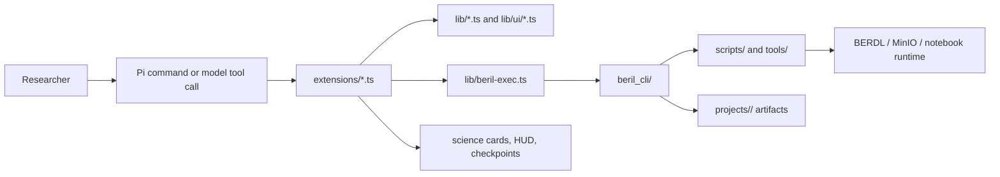

# Architecture

Update this page when ownership moves between skills, extensions, shared
TypeScript, the Python CLI, or the standalone BERDL substrate.

## Product boundary

`beril-pi-agent` is a self-contained Pi terminal/TUI research co-scientist. It
is not a web application and does not import from the original BERIL Research
Observatory. The repository root is the workspace; research projects live under
`projects/<id>/`.

The core split is judgment versus surface versus execution:

| Layer | Owns | Must not own |
| --- | --- | --- |
| `skills/*/SKILL.md` | Scientific protocols, biological interpretation, query patterns, review rubrics, research judgment | State mutation, subprocess mechanics, UI rendering |
| `extensions/*.ts` | Pi tools and commands, event hooks, orchestration, safety, cards, widgets, fast UI caches | Reimplementation of BERDL access or lifecycle persistence |
| `lib/*.ts`, `lib/ui/*.ts` | Shared pure logic, parsers, clients, policies, review helpers, and reusable rendering | Independent durable authority |
| `beril_cli/` | Installed `beril` command, lifecycle state machine, JSON command contracts, thin execution wrappers | Pi UI and scientific interpretation |
| `scripts/`, `tools/` | Standalone Spark, notebook, discovery, export, hashing, and upload substrate | Pi package behavior |

## Execution flow

`berilExec(pi, args)` is the normal TypeScript-to-Python bridge. It runs the
installed `beril` executable, maps exit codes, and parses JSON. Query/discovery
wrappers use a temporary JSON file because JupyterHub auto-spawn can pollute
stdout; do not simplify those paths into direct stdout parsing.

Use direct TypeScript only when the behavior belongs to the Pi process: UI,
events, read-only HTTP clients, pure policy, bounded model fan-out, or a fast
session cache. Durable lifecycle rules belong in Python so every caller sees the
same enforcement.

## State planes

| State/artifact | Authority and purpose | Owner |
| --- | --- | --- |
| `projects/<id>/beril.yaml` | Authoritative lifecycle, authors, gates, approval, submissions | Python lifecycle code |
| `projects/<id>/claims.json` | First-class claim/evidence state derived from the plan/report | Governance and claim-state logic |
| `projects/<id>/provenance.json` | Latest inspectable runtime/session snapshot and bounded research orientation | Audit/memory/world-model extensions |
| `projects/<id>/TRACE.jsonl` | Append-only local audit trace | Python lifecycle and audit extension |
| `projects/<id>/REPORT.md`, notebooks, figures, reviews | Human-readable scientific record and saved analysis outputs | Skills plus notebook/review execution |
| Pi session tree | Conversation history, branches, bookmarks, reroll seams | Pi session APIs and reroll/aside extensions |
| `~/.beril/agora` or `$BERIL_COMMONS_DIR` | Cross-project, append-only knowledge commons | `beril commons`; never project-local |

TypeScript may cache environment, project, or lifecycle information for UI
latency, but caches are never authoritative. Re-derive gates and irreversible
decisions from durable state.

## Placement rules

- New scientific procedure or rubric: a skill, with execution delegated to
  existing tools or commands.
- New model-callable primitive or visual surface: an extension backed by pure
  `lib/` logic when it needs tests or reuse.
- New durable state transition or filesystem contract: `beril_cli/`, surfaced
  through `berilExec`.
- New BERDL/Spark/MinIO mechanic: a standalone script or tool wrapped by the
  CLI; keep its dependency environment uv-managed.
- Independent reasoning that must not inherit the author session: the bounded,
  read-only review subagent in `lib/review-agent.ts`; do not create another
  subagent or store without a demonstrated need.
- Destructive behavior: register it in `lib/destructive.ts` and preserve the
  central `beril-safety` gate plus any command-path confirmation.

The detailed live surface is in [`capability-map.md`](capability-map.md). The
original placement rationale is in the dated
[`skill-home mapping`](../superpowers/specs/2026-06-06-skill-home-mapping.md).
